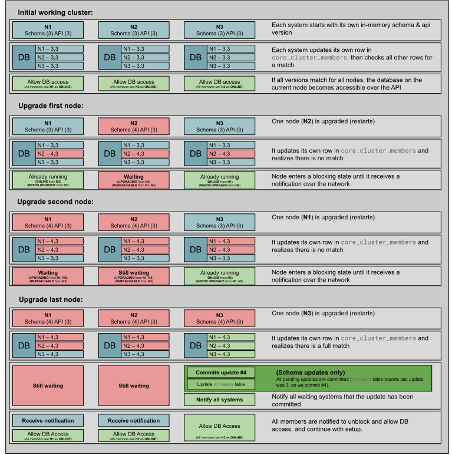

# Upgrading Microcluster

Upgrading refers to coordinating the move to a new build of a project using Microcluster, that introduces logical changes like an alteration to the database schema or a change to the API.

## Schema Updates

The [app.Start function](https://github.com/canonical/microcluster/blob/v3/microcluster/app.go#L69-L92) accepts as argument a list of functions that are run in sequence. The functions supply a database transaction that can be used to extend or modify the schema of the dqlite database supplied to Microcluster. The order of this list must not change, and new updates must be added to the end of the list, in the order that they must be executed.

A schema version is maintained per cluster member representing the sum-total of updates that the member is locally aware of.

### Example

https://github.com/canonical/microcluster/blob/v3/example/database/extended_schema.go#L11-L16

## API Extensions

The [app.Start function](https://github.com/canonical/microcluster/blob/v3/microcluster/app.go#L69-L92) accepts as argument a `[]string` that is interpreted as an ordered list of labels corresponding to changes to the API. The order of this list should not change over time.

### Example

https://github.com/canonical/microcluster/blob/v3/example/api/extensions.go

## Upgrade Behaviour

In order to ensure consistent behaviour across the cluster, schema updates are only committed to the database once all members' expected schema versions are consistent.

For each cluster member, when restarting the microcluster service with a new build that includes new schema updates or API extensions, this member will enter a waiting state until all members have encountered the same updates.

If a cluster member is restarted with an out-of-date schema version or API extension count, it will exit with an error informing that an upgrade is available.

Un-upgraded members will not be affected by the upgrade and continue to function as normal. However, they will not be able to communicate with any members waiting for an upgrade to be committed.

* On un-upgraded members, [client.GetClusterMembers](https://github.com/canonical/microcluster/blob/4d80df396e335bf26f9895956e846e082bb8f624/internal/rest/client/cluster.go#L40-L49) will report [UNREACHABLE](https://github.com/canonical/microcluster/blob/4d80df396e335bf26f9895956e846e082bb8f624/rest/types/cluster.go#L47) for any members that have encountered an upgrade and are waiting.

* On upgraded members, before the upgrade is committed, [client.GetClusterMembers](https://github.com/canonical/microcluster/blob/4d80df396e335bf26f9895956e846e082bb8f624/internal/rest/client/cluster.go#L40-L49) will report [UPGRADING](https://github.com/canonical/microcluster/blob/4d80df396e335bf26f9895956e846e082bb8f624/rest/types/cluster.go#L56) for all waiting members, and [NEEDS UPGRADE](https://github.com/canonical/microcluster/blob/4d80df396e335bf26f9895956e846e082bb8f624/rest/types/cluster.go#L59) for all un-upgraded members.

## Example Schema Upgrade

The following example performs a schema upgrade on a 3 member cluster, incrementing the schema version by 1. Adding additional API extensions would have the same behaviour.

